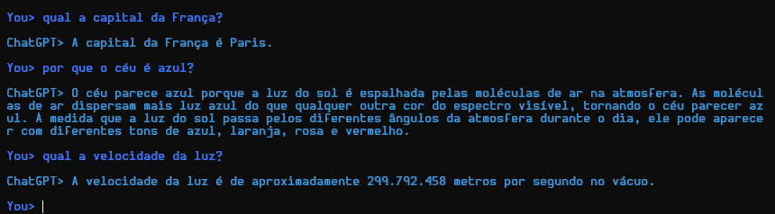

# Python-ChatGPT
a simple chatgpt client using python 3.

## Requirements
#### To be runned, this code needs the version 3 of Python and the lib "openai" installed. To install that, just run:
```
pip3 install openai
```
---

